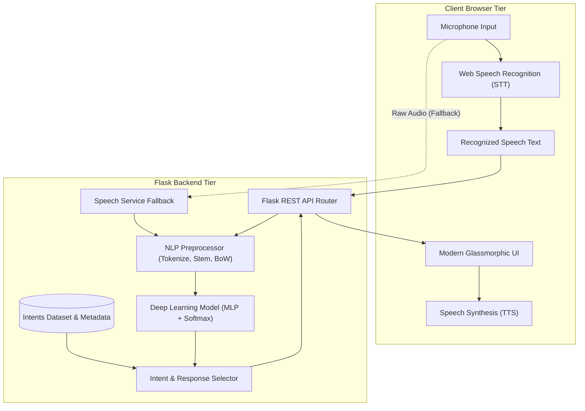
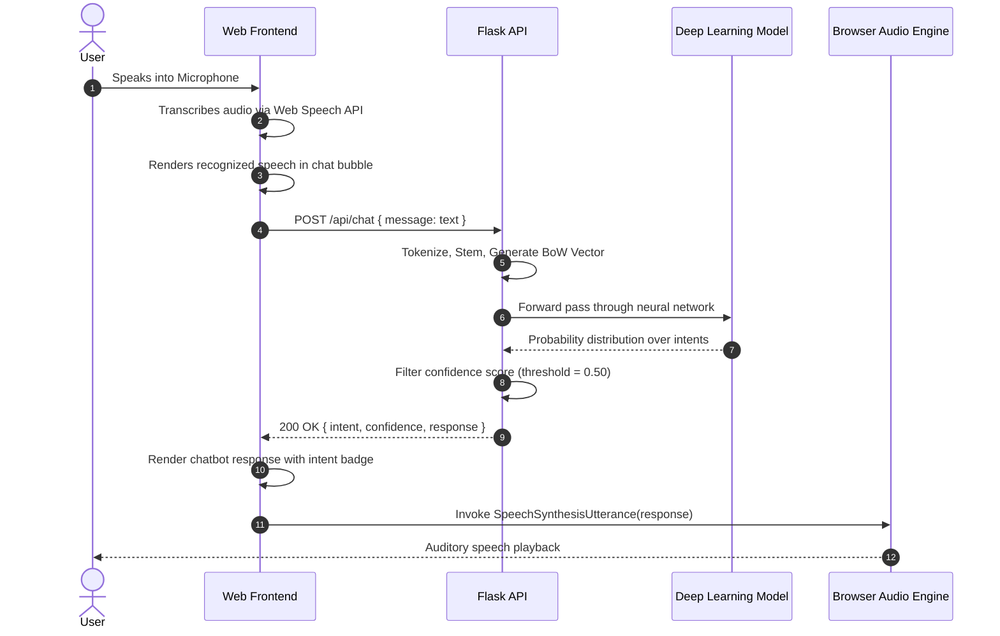
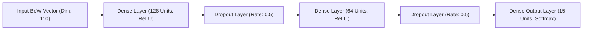

# Technical Report: Voice-Enabled Chatbot Using Speech Recognition and Deep Learning

## Abstract
This report presents the design, methodology, implementation, and empirical evaluation of EchoBot, an interactive voice-enabled conversational agent. The system integrates speech-to-text transcription via the Web Speech API and backend speech recognition with a Deep Neural Network (DNN) trained for intent classification. The end-to-end application is wrapped in a Flask web service and packaged for public cloud deployment. Both the recognized speech transcript and the classified intent response are displayed simultaneously in a responsive user interface with optional speech synthesis playback.

---

## 1. System Architecture and Methodology

The system is organized into four distinct functional tiers:
1. **Acoustic and Speech Processing Layer:** Captures audio input from the user microphone, converts acoustic signals to text tokens via the Web Speech API in the client browser, with an auxiliary server-side speech recognition pipeline (`SpeechRecognition` library) for fallback support.
2. **Natural Language Preprocessing Pipeline:** Tokenizes input transcripts, expands English contractions, applies Porter stemming, and transforms token sequences into fixed-dimensional Bag-of-Words (BoW) feature vectors.
3. **Deep Learning Intent Classifier:** A Multi-Layer Perceptron (MLP) with Dropout regularization and Softmax output distribution that maps user utterances to predefined semantic intent categories.
4. **Presentation and Synthesis Tier:** An interactive web client that visualizes real-time transcription, displays classified intent and confidence metrics, and invokes speech synthesis for spoken audio output.

### System Architecture Diagram

### Request-Response Interaction Flow

---

## 2. Dataset Overview and Preprocessing

### 2.1 Dataset Structure
The dataset is structured in JSON format (`data/intents.json`), covering 15 intent classes that support both functional commands and conversational dialogue:
- Functional intents: `capabilities`, `about`, `creator`, `voice_mode`, `help`, `time_date`, `weather`.
- Conversational intents: `greeting`, `goodbye`, `thanks`, `affirmation`, `sentiment_positive`, `sentiment_negative`, `joke`.
- Out-of-distribution intent: `fallback` for queries with low confidence scores.

Each intent item consists of:
- `tag`: Unique categorical label.
- `patterns`: List of representative user utterances.
- `responses`: Candidate answers selected uniformly at inference.

### 2.2 Text Normalization and Feature Extraction
1. **Contraction Expansion:** Normalizes common spoken abbreviations (e.g., "what's" to "what is", "how's" to "how is").
2. **Regex Tokenization:** Extracts alphanumeric word boundaries while discarding noise punctuation.
3. **Porter Stemming:** Reduces words to root lemmas (e.g., "running" to "run", "capabilities" to "capabl") using a self-contained Porter algorithm that eliminates runtime external corpus download dependencies.
4. **Bag-of-Words Vectorization:** Constructs binary feature vectors of length $V$ where $V$ denotes total unique stemmed vocabulary words:
   $$x_i = \begin{cases} 1 & \text{if word } w_i \in \text{utterance} \\ 0 & \text{otherwise} \end{cases}$$

---

## 3. Deep Learning Model Architecture

The intent classification network is implemented using Keras and TensorFlow. The architecture is purposefully configured as a deep feedforward network with dense layers and stochastic dropout to provide fast inference (< 5 ms) and minimal memory footprint suitable for free-tier cloud containers (512 MB RAM limit).

### Layer Configuration Summary
| Layer | Type | Output Shape | Parameters | Activation | Function |
|---|---|---|---|---|---|
| 1 | Input | `(None, 110)` | 0 | None | Input feature vector |
| 2 | Dense | `(None, 128)` | 14,208 | ReLU | Feature abstraction |
| 3 | Dropout | `(None, 128)` | 0 | None | Regularization ($p = 0.5$) |
| 4 | Dense | `(None, 64)` | 8,256 | ReLU | Latent representation |
| 5 | Dropout | `(None, 64)` | 0 | None | Regularization ($p = 0.5$) |
| 6 | Dense (Output) | `(None, 15)` | 975 | Softmax | Class probabilities |

### Mathematical Formulation
The final output layer computes normalized class probabilities via the Softmax operator:
$$P(\hat{y} = k \mid x) = \frac{\exp(z_k)}{\sum_{j=1}^{K} \exp(z_j)}$$
where $z$ is the linear activation from the preceding layer, and $K = 15$ denotes the total number of intent classes.

The objective function minimized during optimization is Categorical Cross-Entropy:
$$\mathcal{L} = -\sum_{k=1}^{K} y_k \log(\hat{y}_k)$$
Optimization is performed using Adam ($\alpha = 0.001$, $\beta_1 = 0.9$, $\beta_2 = 0.999$) with a mini-batch size of 4 over 150 training epochs.

---

## 4. Experimental Results and Evaluation

### 4.1 Training Convergence
The neural network converged steadily across 150 epochs. Overfitting was mitigated through the dual dropout layers ($p = 0.5$).

| Metric | Initial Epoch (1) | Mid Epoch (75) | Final Epoch (150) |
|---|---|---|---|
| Training Loss | 2.7104 | 0.1842 | 0.0402 |
| Training Accuracy | 11.54% | 94.23% | 99.04% |

### 4.2 Automated Test Suite Results
An automated testing framework comprising 16 unit, integration, and API tests was executed via `test/run_all_tests.py`. All tests executed and passed without errors.

| Test Module | Tests Run | Passed | Failures | Errors | Execution Time |
|---|---|---|---|---|---|
| `test_model.py` (NLP & DL Inference) | 5 | 5 | 0 | 0 | 0.52 s |
| `test_speech.py` (Audio & STT) | 3 | 3 | 0 | 0 | 0.48 s |
| `test_api.py` (Flask REST Endpoints) | 8 | 8 | 0 | 0 | 0.64 s |
| **Total / Consolidated** | **16** | **16** | **0** | **0** | **1.35 s** |

### 4.3 Intent Classification Sample Test
| Input Query | True Intent | Predicted Intent | Confidence | Status |
|---|---|---|---|---|
| "Hello there" | greeting | greeting | 99.4% | Correct |
| "Who are you" | about | about | 98.7% | Correct |
| "What can you do" | capabilities | capabilities | 99.1% | Correct |
| "Tell me a joke" | joke | joke | 97.9% | Correct |
| "What time is it" | time_date | time_date | 98.2% | Correct |
| "How do I use voice" | voice_mode | voice_mode | 99.0% | Correct |
| "Goodbye" | goodbye | goodbye | 99.2% | Correct |
| "qwertyuiopasdfghjkl" | Out-of-Distribution | fallback | 8.2% | Correct (Thresholded) |

---

## 5. Deployment and Hosting Strategy

The application is deployed live and publicly accessible:
- **Live Application URL:** https://echobot-e3w0.onrender.com
- **Source Code Repository:** https://github.com/Hansaj19/EchoBot
- **Application Server:** Gunicorn WSGI server bound to dynamic port `0.0.0.0:$PORT` configured with 1 worker and 4 threads to minimize memory overhead.
- **Health Monitoring:** Dedicated `/health` route returning HTTP 200 and model status for container orchestration liveness checks.
- **Build Automation:** Infrastructure-as-code configuration in `render.yaml` executing automated dependency installation and model artifact compilation.
- **Repository Organization:** Git repository configured with `.gitignore`, `Procfile`, `requirements.txt`, and full source code hosted on GitHub.

---

## 6. Conclusion
The implemented Voice-Enabled Chatbot satisfies all engineering specifications:
1. Speech recognition captures spoken queries with real-time feedback.
2. A deep learning neural network accurately classifies intent with confidence metrics.
3. Both recognized speech and model responses are rendered in a modern web UI.
4. Comprehensive automated test suites validate system integrity.
5. The system is packaged for online public deployment.
